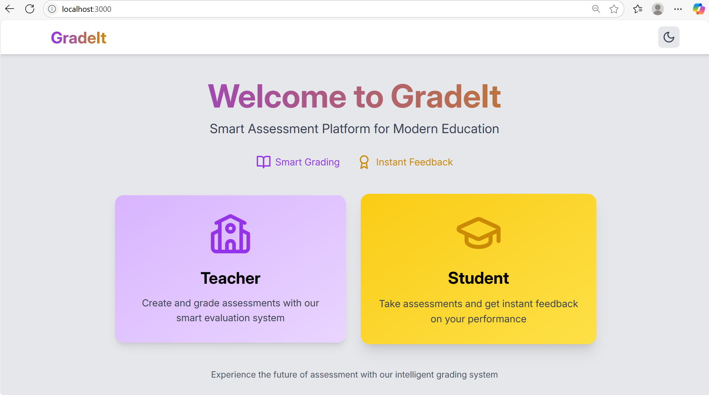
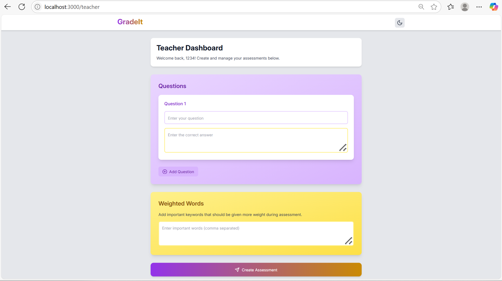
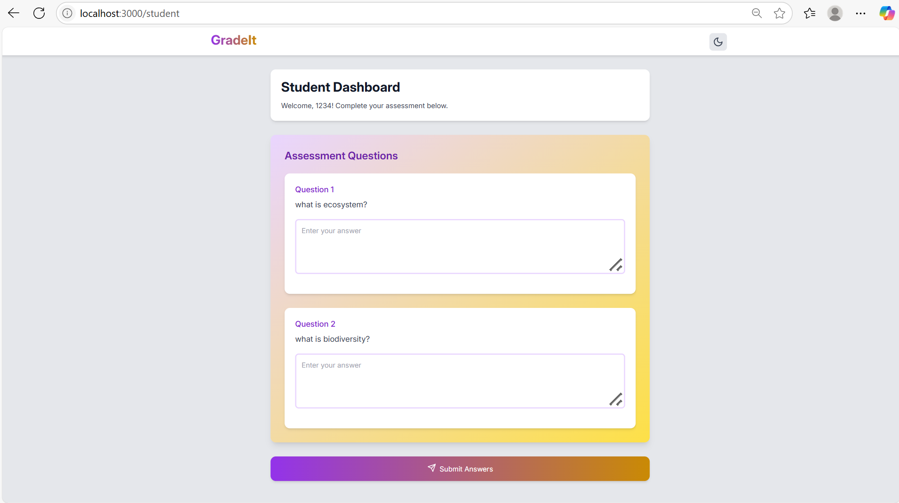
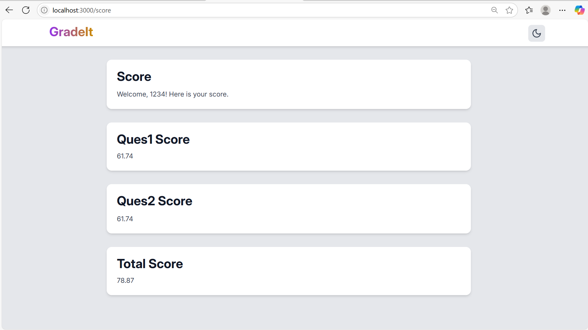

#  Subjective-Answer-Checker

The Subjective Answer Checker is a Python-based system that automates grading of subjective answers using NLP techniques like lemmatization, POS tagging, and sentiment analysis. It compares student responses to reference answers, calculates similarity using Jaccard, and provides instant feedback via a simple GUI.

Designed to compare student-written answers with ideal teacher-provided answers using keyword matching. This system helps in quickly evaluating descriptive answers in educational settings.

##  Features

-  Compare student answers with model answers
-  Keyword-based similarity check
-  Highlight missing or matched keywords
-  Simple UI for input and result display
-  React frontend and Flask backend

##  Getting Started
Follow the instructions below to run the project locally on your machine.

##  Prerequisites
- Node.js and npm installed
- Python 3.x installed
- Git installed

##  Clone the Repository

```bash
  git clone https://github.com/kanishkaag/subjective-answer-checker.git
  cd subjective-answer-checker
```

##  Backend Setup (Flask)
1. Navigate to the backend directory:
```bash
  cd backend
```
2.  Install backend dependencies:
```bash
  pip install -r requirements.txt
```

3.  Start the Flask server:
```python
  python app.py
```

##  Frontend Setup (React)
1. Navigate to the frontend directory:
```bash
  cd frontend
```

2. Install dependencies:
```bash
  npm install
```

3.  Start the frontend development server:
```bash
  npm run dev
```


##  How to Use
Open your browser and go to: http://localhost:3000/

Enter the required inputs:

✏️ Question

👩‍🏫 Teacher's Answer

🧠 Keywords (comma-separated)

👨‍🎓 Student's Answer

Click the Check button to analyze.

##  Screenshots

###  Input Form Page


###  Teacher Dashboard


###  Student Dashboard


###  Score


## Flow Diagram


🙋 Author - 
Kanishka Agrawal

https://github.com/kanishkaag
